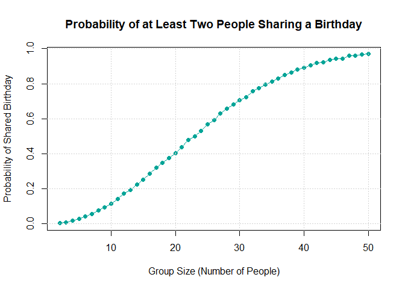
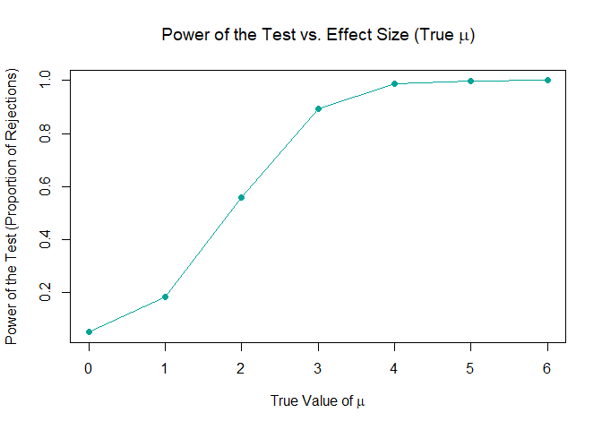

p8105_hw5_xx2485
================
Xiaoni Xu
2024-11-14

Loading needed packages

``` r
library(tidyverse)
library(dplyr)
```

### Problem 1

Write a function that, for a fixed group size, randomly draws
“birthdays” for each person; checks whether there are duplicate
birthdays in the group; and returns TRUE or FALSE based on the result.

``` r
has_duplicate_birthday <- function(n) {
  birthdays <- sample(1:365, n, replace = TRUE)
  
  # Check if there are any duplicates and return TRUE if there are, FALSE otherwise
  any(duplicated(birthdays))
}

# Test the function for a group of 23 people
has_duplicate_birthday(23)
```

    ## [1] TRUE

Run this function 10000 times for each group size between 2 and 50.

``` r
compute_probabilities <- function(group_sizes, simulations = 10000) {
  probabilities <- numeric(length(group_sizes))
  for (i in seq_along(group_sizes)) {
    n <- group_sizes[i]
    duplicates <- sum(replicate(simulations, has_duplicate_birthday(n)))
    probabilities[i] <- duplicates / simulations
  }
  return(probabilities)
}

# For each group size, compute the probability that at least two people in the group will share a birthday by averaging across the 10000 simulation runs.
group_sizes <- 2:50
probabilities <- compute_probabilities(group_sizes)
```

Make a plot showing the probability as a function of group size, and
comment on your results.

``` r
# Plot the results
plot(group_sizes, probabilities, type = "o", pch = 16, col = "#00a497", 
     xlab = "Group Size (Number of People)", ylab = "Probability of Shared Birthday",
     main = "Probability of at Least Two People Sharing a Birthday")
grid()
```

<!-- --> The
curve shows a typical S-shape with the reflection point ar around 23.
The curve shows a generally exponential growth between population size
of 2 and 23, and a stabilization phase between population size of 23 and
50. Starting from group size of 2, the probability of shared birthday is
almost 0, and for group size of 50, the probability of such reaches 1.

### Problem 2

``` r
# Define a function to simulate data
sim_mean_pval <- function(n, mu = 0, sigma = 5) {
  sim_data <- tibble(
    x = rnorm(n, mean = mu, sd = sigma)
  )
  # Estimate mean and perform t-test
  t_test_result <- t.test(sim_data$x, mu = 0)
  result <- tibble(
    mu_hat = mean(sim_data$x),
    p_value = broom::tidy(t_test_result)$p.value
  )
  return(result)
}

# Run the function 5000 times and store results
set.seed(1)  # For reproducibility
output <- vector("list", 5000)

for (i in 1:5000) {
  output[[i]] <- sim_mean_pval(n = 30)
}

# Combine the results into a single data frame
sim_results <- bind_rows(output)

# Display a summary of the results
summary(sim_results)
```

    ##      mu_hat             p_value         
    ##  Min.   :-3.246866   Min.   :0.0000413  
    ##  1st Qu.:-0.609636   1st Qu.:0.2551096  
    ##  Median :-0.001290   Median :0.5095235  
    ##  Mean   :-0.000262   Mean   :0.5063292  
    ##  3rd Qu.: 0.587596   3rd Qu.:0.7594241  
    ##  Max.   : 3.363020   Max.   :0.9999478

Repeat for mu = 1, 2, 3, 4, 5, 6

``` r
# Run the simulation for mu values from 1 to 6
mu_values <- 1:6
results <- list()

for (mu in mu_values) {
  # Store results for each mu in a list of data frames
  mu_output <- replicate(5000, sim_mean_pval(n = 30, mu = mu), simplify = TRUE)
  sim_results <- as.data.frame(t(mu_output))
  sim_results$mu <- mu  # Add a column indicating the current mu value
  results[[as.character(mu)]] <- sim_results
}

# Combine all results into a single data frame
all_results <- bind_rows(results)
```

Make a plot showing the proportion of times the null was rejected (the
power of the test) on the y axis and the true value of $\mu$ on the x
axis.

``` r
# Calculate the proportion of times the null hypothesis was rejected for each mu value
power <- all_results %>%
  group_by(mu) %>%
  summarize(power = mean(p_value < 0.05))

# Plot the power of the test versus the true mean (mu)
plot(power$mu, power$power, type = "o", pch = 16, col = "blue",
     xlab = "True Value of * mu *", ylab = "Power of the Test (Proportion of Rejections)",
     main = "Power of the Test vs. Effect Size (True * mu *)")
grid()
```

<!-- -->

As the effect size (in this case, the true mean $\mu$) increases, the
power of the test also increases.
