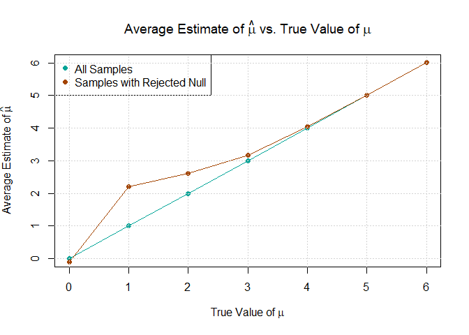

p8105_hw5_xx2485
================
Xiaoni Xu
2024-11-14

Loading needed packages

``` r
library(tidyverse)
library(dplyr)
library(readr)
library(purrr)
library(tidyr)
library(knitr)
library(ggplot2)
```

### Problem 1

Write a function that, for a fixed group size, randomly draws
“birthdays” for each person; checks whether there are duplicate
birthdays in the group; and returns TRUE or FALSE based on the result.

``` r
has_duplicate_birthday <- function(n) {
  birthdays <- sample(1:365, n, replace = TRUE)
  
  # Check if there are any duplicates and return TRUE if there are, FALSE otherwise
  any(duplicated(birthdays))
}

# Test the function for a group of 23 people
has_duplicate_birthday(23)
```

    ## [1] FALSE

Run this function 10000 times for each group size between 2 and 50.

``` r
compute_probabilities <- function(group_sizes, simulations = 10000) {
  probabilities <- numeric(length(group_sizes))
  for (i in seq_along(group_sizes)) {
    n <- group_sizes[i]
    duplicates <- sum(replicate(simulations, has_duplicate_birthday(n)))
    probabilities[i] <- duplicates / simulations
  }
  return(probabilities)
}

# For each group size, compute the probability that at least two people in the group will share a birthday by averaging across the 10000 simulation runs.
group_sizes <- 2:50
probabilities <- compute_probabilities(group_sizes)
```

Make a plot showing the probability as a function of group size, and
comment on your results.

``` r
# Plot the results
plot(group_sizes, probabilities, type = "o", pch = 16, col = "#00a497", 
     xlab = "Group Size (Number of People)", ylab = "Probability of Shared Birthday",
     main = "Probability of at Least Two People Sharing a Birthday")
grid()
```

<!-- --> The
curve shows a typical S-shape with the reflection point ar around 23.
The curve shows a generally exponential growth between population size
of 2 and 23, and a stabilization phase between population size of 23 and
50. Starting from group size of 2, the probability of shared birthday is
almost 0, and for group size of 50, the probability of such reaches 1.

### Problem 2

``` r
# Define a function to simulate data
sim_mean_pval <- function(n, mu = 0, sigma = 5) {
  sim_data <- tibble(
    x = rnorm(n, mean = mu, sd = sigma)
  )
  # Estimate mean and perform t-test
  t_test_result <- t.test(sim_data$x, mu = 0)
  result <- tibble(
    mu_hat = mean(sim_data$x),
    p_value = broom::tidy(t_test_result)$p.value
  )
  return(result)
}

# Run the function 5000 times and store results
set.seed(1)  # For reproducibility
output <- vector("list", 5000)

for (i in 1:5000) {
  output[[i]] <- sim_mean_pval(n = 30)
}

# Combine the results into a single data frame
sim_results <- bind_rows(output)

# Display a summary of the results
summary(sim_results)
```

    ##      mu_hat             p_value         
    ##  Min.   :-3.246866   Min.   :0.0000413  
    ##  1st Qu.:-0.609636   1st Qu.:0.2551096  
    ##  Median :-0.001290   Median :0.5095235  
    ##  Mean   :-0.000262   Mean   :0.5063292  
    ##  3rd Qu.: 0.587596   3rd Qu.:0.7594241  
    ##  Max.   : 3.363020   Max.   :0.9999478

Repeat for mu = 1, 2, 3, 4, 5, 6

``` r
# Run the simulation for mu values from 1 to 6
mu_values <- 0:6
results <- list()

for (mu in mu_values) {
  # Store results for each mu in a list of data frames
  output <- replicate(5000, sim_mean_pval(n = 30, mu = mu), simplify = TRUE)
  sim_results <- as.data.frame(t(output))
  sim_results$mu <- mu  # Add a column indicating the current mu value
  results[[as.character(mu)]] <- sim_results
}

# Combine all results into a single data frame
all_results <- bind_rows(results)
```

Make a plot showing the proportion of times the null was rejected (the
power of the test) on the y axis and the true value of $\mu$ on the x
axis.

``` r
# Calculate the proportion of times the null hypothesis was rejected for each mu value
power <- all_results %>%
  group_by(mu) %>%
  summarize(power = mean(p_value < 0.05))

# Plot the power of the test versus the true mean (mu)
plot(power$mu, power$power, type = "o", pch = 16, col = "#00a497",
     xlab = expression("True Value of " * mu), 
     ylab = "Power of the Test (Proportion of Rejections)",
     main = expression("Power of the Test vs. Effect Size (True " * mu * ")"))
```

<!-- -->

Power represents the probability of correctly rejecting the null
hypothesis when it is false. As the effect size (in this case, the true
mean $\mu$) increases, the power of the test also increases.

Make a plot showing the average estimate of $\hat{\mu}$ on the y-axis
and the true value of $\mu$ on the x-axis; make a second plot (or
overlay on the first) showing the average estimate of $\hat{\mu}$ only
in samples for which the null was rejected on the y-axis and the true
value of $\mu$ on the x-axis.

``` r
# Ensure mu_hat is numeric
all_results$mu_hat <- as.numeric(all_results$mu_hat)

# Calculate the average estimate of mu_hat for each true mu
avg_mu_hat <- all_results %>%
  group_by(mu) %>%
  summarize(avg_mu_hat = mean(mu_hat, na.rm = TRUE))

# Calculate the average estimate of mu_hat only for samples where null was rejected
avg_mu_hat_rejected <- all_results %>%
  filter(p_value < 0.05) %>%
  group_by(mu) %>%
  summarize(avg_mu_hat_rejected = mean(mu_hat, na.rm = TRUE))

# Merge the two datasets
plot_data <- left_join(avg_mu_hat, avg_mu_hat_rejected, by = "mu")

# Plot the average estimate of mu_hat vs. the true value of mu
plot(plot_data$mu, plot_data$avg_mu_hat, type = "o", pch = 16, col = "#00a497",
     xlab = expression("True Value of " * mu),
     ylab = expression("Average Estimate of " * hat(mu)),
     main = expression("Average Estimate of " * hat(mu) * " vs. True Value of " * mu))
lines(plot_data$mu, plot_data$avg_mu_hat_rejected, type = "o", pch = 16, col = "#a34400")
legend("topleft", legend = c("All Samples", "Samples with Rejected Null"),
       col = c("#00a497", "#a34400"), pch = 16)
grid()
```

<!-- -->

Is the sample average of $\hat{\mu}$ across tests for which the null is
rejected approximately equal to the true value of $\mu$? Why or why not?

No, the sample average of $\hat{\mu}$ across tests for which the null is
rejected is generally NOT approximately equal to the true value of
$\mu$. This discrepancy can be seen on the plot for lower $\mu$ values
of 1, 2, and 3. For $\mu$ = 4, 5, 6, the sample average of $\hat{\mu}$
is closer t the true value of $\mu$. For $\mu$ = 0, the observed data
has no deviation from 0, thus no effect size. The variability in
$\hat{\mu}$ only comes from random sampling error, which is balanced
around the true value of 0. This explains $\hat{\mu}$ and $\mu$ being
closer to each other at 0.

This discrepancy arises due to selection bias. When we only consider
samples in which the null hypothesis is rejected (i.e., $p < 0.05$), we
are more likely to include samples with values of $\hat{\mu}$ that
deviate farther from zero.

## Problem 3

Loading the data

``` r
# Define the URL of the CSV file
url <- "https://raw.githubusercontent.com/washingtonpost/data-homicides/master/homicide-data.csv"

# Read the CSV file into a data frame
homicide_data <- read_csv(url)
```

    ## Rows: 52179 Columns: 12
    ## ── Column specification ────────────────────────────────────────────────────────
    ## Delimiter: ","
    ## chr (9): uid, victim_last, victim_first, victim_race, victim_age, victim_sex...
    ## dbl (3): reported_date, lat, lon
    ## 
    ## ℹ Use `spec()` to retrieve the full column specification for this data.
    ## ℹ Specify the column types or set `show_col_types = FALSE` to quiet this message.

``` r
# Display the first few rows of the data frame
head(homicide_data)
```

    ## # A tibble: 6 × 12
    ##   uid   reported_date victim_last victim_first victim_race victim_age victim_sex
    ##   <chr>         <dbl> <chr>       <chr>        <chr>       <chr>      <chr>     
    ## 1 Alb-…      20100504 GARCIA      JUAN         Hispanic    78         Male      
    ## 2 Alb-…      20100216 MONTOYA     CAMERON      Hispanic    17         Male      
    ## 3 Alb-…      20100601 SATTERFIELD VIVIANA      White       15         Female    
    ## 4 Alb-…      20100101 MENDIOLA    CARLOS       Hispanic    32         Male      
    ## 5 Alb-…      20100102 MULA        VIVIAN       White       72         Female    
    ## 6 Alb-…      20100126 BOOK        GERALDINE    White       91         Female    
    ## # ℹ 5 more variables: city <chr>, state <chr>, lat <dbl>, lon <dbl>,
    ## #   disposition <chr>

The dataset contains information about homicides across different
cities, with columns capturing details about each victim and the case’s
disposition status. The variables are as following:

- `uid`: A unique identifier for each homicide case.

- `reported_date`: The date the homicide was reported, in YYYYMMDD
  format.

- `victim_last` and `victim_first`: The last and first names of the
  victim.

- `victim_race`: The race of the victim (e.g., Hispanic, White).

- `victim_age`: The age of the victim at the time of the homicide.

- `victim_sex`: The gender of the victim.

- `city` and `state`: The city and state where the homicide occurred.

- `lat` and `lon`: Latitude and longitude coordinates of the homicide
  location.

- `disposition`: The status of the case, indicating whether it was
  solved. Possible values include “Closed by arrest,” “Closed without
  arrest,” and “Open/No arrest.”

Create a `city_state variable` and then summarize within cities to
obtain the total number of homicides and the number of unsolved
homicides.

``` r
# Create the city_state variable
homicide_data <- homicide_data %>%
  mutate(city_state = paste(city, state, sep = ", "))

# Define unsolved dispositions
unsolved_dispositions <- c("Closed without arrest", "Open/No arrest")

# Summarize data by city
city_summary <- homicide_data %>%
  group_by(city_state) %>%
  summarize(
    total_homicides = n(),
    unsolved_homicides = sum(disposition %in% unsolved_dispositions)
  )

# Display the summarized data
city_summary %>%
  kable(
    col.names = c("City, State", "Total Homicides", "Unsolved Homicides"),
    caption = "Summary of Homicides by City"
  )
```

| City, State        | Total Homicides | Unsolved Homicides |
|:-------------------|----------------:|-------------------:|
| Albuquerque, NM    |             378 |                146 |
| Atlanta, GA        |             973 |                373 |
| Baltimore, MD      |            2827 |               1825 |
| Baton Rouge, LA    |             424 |                196 |
| Birmingham, AL     |             800 |                347 |
| Boston, MA         |             614 |                310 |
| Buffalo, NY        |             521 |                319 |
| Charlotte, NC      |             687 |                206 |
| Chicago, IL        |            5535 |               4073 |
| Cincinnati, OH     |             694 |                309 |
| Columbus, OH       |            1084 |                575 |
| Dallas, TX         |            1567 |                754 |
| Denver, CO         |             312 |                169 |
| Detroit, MI        |            2519 |               1482 |
| Durham, NC         |             276 |                101 |
| Fort Worth, TX     |             549 |                255 |
| Fresno, CA         |             487 |                169 |
| Houston, TX        |            2942 |               1493 |
| Indianapolis, IN   |            1322 |                594 |
| Jacksonville, FL   |            1168 |                597 |
| Kansas City, MO    |            1190 |                486 |
| Las Vegas, NV      |            1381 |                572 |
| Long Beach, CA     |             378 |                156 |
| Los Angeles, CA    |            2257 |               1106 |
| Louisville, KY     |             576 |                261 |
| Memphis, TN        |            1514 |                483 |
| Miami, FL          |             744 |                450 |
| Milwaukee, wI      |            1115 |                403 |
| Minneapolis, MN    |             366 |                187 |
| Nashville, TN      |             767 |                278 |
| New Orleans, LA    |            1434 |                930 |
| New York, NY       |             627 |                243 |
| Oakland, CA        |             947 |                508 |
| Oklahoma City, OK  |             672 |                326 |
| Omaha, NE          |             409 |                169 |
| Philadelphia, PA   |            3037 |               1360 |
| Phoenix, AZ        |             914 |                504 |
| Pittsburgh, PA     |             631 |                337 |
| Richmond, VA       |             429 |                113 |
| Sacramento, CA     |             376 |                139 |
| San Antonio, TX    |             833 |                357 |
| San Bernardino, CA |             275 |                170 |
| San Diego, CA      |             461 |                175 |
| San Francisco, CA  |             663 |                336 |
| Savannah, GA       |             246 |                115 |
| St. Louis, MO      |            1677 |                905 |
| Stockton, CA       |             444 |                266 |
| Tampa, FL          |             208 |                 95 |
| Tulsa, AL          |               1 |                  0 |
| Tulsa, OK          |             583 |                193 |
| Washington, DC     |            1345 |                589 |

Summary of Homicides by City

For the city of Baltimore, MD, use the `prop.test` function to estimate
the proportion of homicides that are unsolved; save the output of
`prop.test` as an R object, apply the `broom::tidy` to this object and
pull the estimated proportion and confidence intervals from the
resulting tidy dataframe.

``` r
# Filter data for Baltimore, MD
baltimore_data <- homicide_data %>%
  filter(city == "Baltimore" & state == "MD")

# Count total cases and unsolved cases
total_cases <- nrow(baltimore_data)
unsolved_cases <- baltimore_data %>%
  filter(disposition == "Closed without arrest" | disposition == "Open/No arrest") %>%
  nrow()

# Perform a proportion test
prop_test_result <- prop.test(unsolved_cases, total_cases)

tidy_result <- broom::tidy(prop_test_result)

# Extract the estimated proportion and confidence intervals
estimated_proportion <- tidy_result %>% pull(estimate)
conf_low <- tidy_result %>% pull(conf.low)
conf_high <- tidy_result %>% pull(conf.high)

# Display the results
estimated_proportion
```

    ##         p 
    ## 0.6455607

``` r
conf_low
```

    ## [1] 0.6275625

``` r
conf_high
```

    ## [1] 0.6631599

Run `prop.test` for each of the cities in the dataset, and extract both
the proportion of unsolved homicides and the confidence interval for
each.

``` r
# Create a tidy pipeline to calculate proportions and confidence intervals for each city
city_results <- homicide_data %>%
  mutate(city_state = paste(city, state, sep = ", ")) %>%
  # Summarize by city to get total cases and unsolved cases
  group_by(city_state) %>%
  summarize(
    total_cases = n(),
    unsolved_cases = sum(disposition == "Closed without arrest" | disposition == "Open/No arrest")
  ) %>%
  # Run `prop.test` for each city using `map`
  mutate(
    prop_test = map2(unsolved_cases, total_cases, ~prop.test(.x, .y) %>% broom::tidy())
  ) %>%
  # Unnest the results to create a tidy data frame with proportions and CIs
  unnest(prop_test) %>%
  # Select relevant columns for final output
  select(city_state, estimated_proportion = estimate, conf_low = conf.low, conf_high = conf.high)
```

    ## Warning: There was 1 warning in `mutate()`.
    ## ℹ In argument: `prop_test = map2(unsolved_cases, total_cases, ~prop.test(.x,
    ##   .y) %>% broom::tidy())`.
    ## Caused by warning in `prop.test()`:
    ## ! Chi-squared approximation may be incorrect

``` r
# Display city_results
city_results %>%
  kable(
    col.names = c("City, State", "Estimated Proportion of Unsolved Cases", "Confidence Interval Low", "Confidence Interval High"),
    caption = "Proportion of Unsolved Homicide Cases by City with Confidence Intervals"
  )
```

| City, State        | Estimated Proportion of Unsolved Cases | Confidence Interval Low | Confidence Interval High |
|:-------------------|---------------------------------------:|------------------------:|-------------------------:|
| Albuquerque, NM    |                              0.3862434 |               0.3372604 |                0.4375766 |
| Atlanta, GA        |                              0.3833505 |               0.3528119 |                0.4148219 |
| Baltimore, MD      |                              0.6455607 |               0.6275625 |                0.6631599 |
| Baton Rouge, LA    |                              0.4622642 |               0.4141987 |                0.5110240 |
| Birmingham, AL     |                              0.4337500 |               0.3991889 |                0.4689557 |
| Boston, MA         |                              0.5048860 |               0.4646219 |                0.5450881 |
| Buffalo, NY        |                              0.6122841 |               0.5687990 |                0.6540879 |
| Charlotte, NC      |                              0.2998544 |               0.2660820 |                0.3358999 |
| Chicago, IL        |                              0.7358627 |               0.7239959 |                0.7473998 |
| Cincinnati, OH     |                              0.4452450 |               0.4079606 |                0.4831439 |
| Columbus, OH       |                              0.5304428 |               0.5002167 |                0.5604506 |
| Dallas, TX         |                              0.4811742 |               0.4561942 |                0.5062475 |
| Denver, CO         |                              0.5416667 |               0.4846098 |                0.5976807 |
| Detroit, MI        |                              0.5883287 |               0.5687903 |                0.6075953 |
| Durham, NC         |                              0.3659420 |               0.3095874 |                0.4260936 |
| Fort Worth, TX     |                              0.4644809 |               0.4222542 |                0.5072119 |
| Fresno, CA         |                              0.3470226 |               0.3051013 |                0.3913963 |
| Houston, TX        |                              0.5074779 |               0.4892447 |                0.5256914 |
| Indianapolis, IN   |                              0.4493192 |               0.4223156 |                0.4766207 |
| Jacksonville, FL   |                              0.5111301 |               0.4820460 |                0.5401402 |
| Kansas City, MO    |                              0.4084034 |               0.3803996 |                0.4370054 |
| Las Vegas, NV      |                              0.4141926 |               0.3881284 |                0.4407395 |
| Long Beach, CA     |                              0.4126984 |               0.3629026 |                0.4642973 |
| Los Angeles, CA    |                              0.4900310 |               0.4692208 |                0.5108754 |
| Louisville, KY     |                              0.4531250 |               0.4120609 |                0.4948235 |
| Memphis, TN        |                              0.3190225 |               0.2957047 |                0.3432691 |
| Miami, FL          |                              0.6048387 |               0.5685783 |                0.6400015 |
| Milwaukee, wI      |                              0.3614350 |               0.3333172 |                0.3905194 |
| Minneapolis, MN    |                              0.5109290 |               0.4585150 |                0.5631099 |
| Nashville, TN      |                              0.3624511 |               0.3285592 |                0.3977401 |
| New Orleans, LA    |                              0.6485356 |               0.6231048 |                0.6731615 |
| New York, NY       |                              0.3875598 |               0.3494421 |                0.4270755 |
| Oakland, CA        |                              0.5364308 |               0.5040588 |                0.5685037 |
| Oklahoma City, OK  |                              0.4851190 |               0.4467861 |                0.5236245 |
| Omaha, NE          |                              0.4132029 |               0.3653146 |                0.4627477 |
| Philadelphia, PA   |                              0.4478103 |               0.4300380 |                0.4657157 |
| Phoenix, AZ        |                              0.5514223 |               0.5184825 |                0.5839244 |
| Pittsburgh, PA     |                              0.5340729 |               0.4942706 |                0.5734545 |
| Richmond, VA       |                              0.2634033 |               0.2228571 |                0.3082658 |
| Sacramento, CA     |                              0.3696809 |               0.3211559 |                0.4209131 |
| San Antonio, TX    |                              0.4285714 |               0.3947772 |                0.4630331 |
| San Bernardino, CA |                              0.6181818 |               0.5576628 |                0.6753422 |
| San Diego, CA      |                              0.3796095 |               0.3354259 |                0.4258315 |
| San Francisco, CA  |                              0.5067873 |               0.4680516 |                0.5454433 |
| Savannah, GA       |                              0.4674797 |               0.4041252 |                0.5318665 |
| St. Louis, MO      |                              0.5396541 |               0.5154369 |                0.5636879 |
| Stockton, CA       |                              0.5990991 |               0.5517145 |                0.6447418 |
| Tampa, FL          |                              0.4567308 |               0.3881009 |                0.5269851 |
| Tulsa, AL          |                              0.0000000 |               0.0000000 |                0.9453792 |
| Tulsa, OK          |                              0.3310463 |               0.2932349 |                0.3711192 |
| Washington, DC     |                              0.4379182 |               0.4112495 |                0.4649455 |

Proportion of Unsolved Homicide Cases by City with Confidence Intervals

Create a plot that shows the estimates and CIs for each city; organize
cities according to the proportion of unsolved homicides.

Notes: There is no city called Tulsa in Alabama (AL) - this might be a
typing error in the original dataset. This data point is thus omitted in
the plot.

``` r
# Arrange city_results by estimated proportion and remove rows with NA estimates
plot_data <- city_results %>%
  filter(city_state != "Tulsa, AL") %>% # Tulsa, AL omitted
  arrange(estimated_proportion) %>%
  mutate(city_state = factor(city_state, levels = city_state))  # Organize cities in order

# Create the plot
ggplot(plot_data, aes(x = city_state, y = estimated_proportion)) +
  geom_errorbar(aes(ymin = conf_low, ymax = conf_high), width = 0.2, size = 0.8, color = "gray") +  
  geom_point(color = "#00a497") +  # Add points for each city's estimated proportion
  coord_flip() +  # Flip coordinates for better readability
  labs(
    x = "City, State",
    y = "Proportion of Unsolved Homicides",
    title = "Estimated Proportion of Unsolved Homicides by City with Confidence Intervals"
  ) +
  theme_minimal()
```

    ## Warning: Using `size` aesthetic for lines was deprecated in ggplot2 3.4.0.
    ## ℹ Please use `linewidth` instead.
    ## This warning is displayed once every 8 hours.
    ## Call `lifecycle::last_lifecycle_warnings()` to see where this warning was
    ## generated.

<!-- -->

### Some purely exploratory plots

NOT PART OF THE ANSWER - DO NOT GRADE. Set to `eval = FALSE` at the
moment.

``` r
library(maps)
library(viridis)

# Prepare city-level data for unsolved homicide proportions
city_summary <- homicide_data %>%
  group_by(city, state) %>%
  summarize(
    total_cases = n(),
    unsolved_cases = sum(disposition == "Closed without arrest" | disposition == "Open/No arrest"),
    estimated_proportion = ifelse(total_cases > 0, unsolved_cases / total_cases, NA)
  ) %>%
  filter(!is.na(estimated_proportion))  # Remove cities with NA proportions

# Add latitude and longitude information for each city
city_summary <- city_summary %>%
  left_join(homicide_data %>% select(city, state, lat, lon) %>% distinct(), by = c("city", "state"))

# Get map data for the US
us_map_data <- map_data("state")

# Plot the heatmap of US cities
ggplot() +
  # Base US map with state boundaries for reference
  geom_polygon(data = us_map_data, aes(x = long, y = lat, group = group),
               fill = "gray90", color = "white", size = 0.5) +
  
  # Overlay city points colored by the proportion of unsolved homicides
  geom_point(data = city_summary, aes(x = lon, y = lat, color = estimated_proportion), size = 3, alpha = 0.7) +
  scale_color_viridis(
    option = "plasma",  # Choose a "viridis" color pattern
    name = "Proportion of Unsolved Homicides"
  ) +
  labs(
    title = "Proportion of Unsolved Homicides by City in the US",
    subtitle = "Data aggregated at the city level"
  ) +
  theme_void() +
  theme(legend.position = "right")
```

``` r
# Create a lookup table to map state abbreviations to full names
state_lookup <- data.frame(
  state_abb = tolower(state.abb),
  state_name = tolower(state.name)
)

# Prepare state-level data for unsolved homicide proportions and convert abbreviations to full names
state_summary <- homicide_data %>%
  mutate(state = tolower(state)) %>%  # Convert state abbreviations to lowercase
  left_join(state_lookup, by = c("state" = "state_abb")) %>%
  group_by(state_name) %>%
  summarize(
    total_cases = n(),
    unsolved_cases = sum(disposition == "Closed without arrest" | disposition == "Open/No arrest"),
    estimated_proportion = ifelse(total_cases > 0, unsolved_cases / total_cases, NA)
  ) %>%
  filter(!is.na(estimated_proportion))  # Remove states with NA proportions

# Get map data for the US states
us_map_data <- map_data("state")

# Merge state summary with map data
map_data <- us_map_data %>%
  left_join(state_summary, by = c("region" = "state_name"))

# Plot the heatmap of US states
ggplot(map_data, aes(x = long, y = lat, group = group, fill = estimated_proportion)) +
  geom_polygon(color = "white") +  # Draw state boundaries in white
  scale_fill_viridis(
    option = "plasma",  # Choose a "viridis" color pattern
    na.value = "gray",  # Gray for states without data
    name = "Proportion of Unsolved Homicides"
  ) +
  labs(
    title = "Proportion of Unsolved Homicides by Biggest Cities of a State in the US",
    subtitle = "Data aggregated at the state level"
  ) +
  theme_void() +
  theme(legend.position = "right")
```

``` r
library(sf)  # For handling spatial data

# Load neighborhood shapefile for the base map
chicago_neighborhoods <- st_read("Neighborhoods_2012b.shx")

# Set the CRS if it's missing, using an appropriate Chicago CRS (e.g., EPSG:3435 for Illinois East)
if (is.na(st_crs(chicago_neighborhoods))) {
  chicago_neighborhoods <- st_set_crs(chicago_neighborhoods, 3435)  # Example CRS for Chicago maps
}

# Convert homicide data to an sf object and classify as solved or unsolved
homicide_sf <- homicide_data %>%
  filter(city == "Chicago") %>%
  mutate(
    status = ifelse(disposition %in% c("Closed by arrest"), "Solved", "Unsolved")
  ) %>%
  st_as_sf(coords = c("lon", "lat"), crs = 4326)  # Assuming WGS84 CRS for lat/lon

# Transform CRS of homicide_sf to match chicago_neighborhoods for proper overlay
homicide_sf <- st_transform(homicide_sf, st_crs(chicago_neighborhoods))

# Create the plot
ggplot() +
  # Plot the Chicago neighborhoods as the base map
  geom_sf(data = chicago_neighborhoods, fill = "gray90", color = "white") +
  
  # Plot each homicide case, coloring by whether it was solved or unsolved
  geom_sf(data = homicide_sf, aes(color = status), size = 2, alpha = 0.3) +
  
  # Define colors for solved and unsolved cases
  scale_color_manual(
    values = c("Unsolved" = "#00a497", "Solved" = "#a34400"),
    name = "Homicide Status"
  ) +
  
  # Plot settings
  labs(
    title = "Homicide Cases in Chicago",
    subtitle = "Distinguishing Solved and Unsolved Cases",
    color = "Case Status"
  ) +
  theme_void() +
  theme(legend.position = "right")
```
